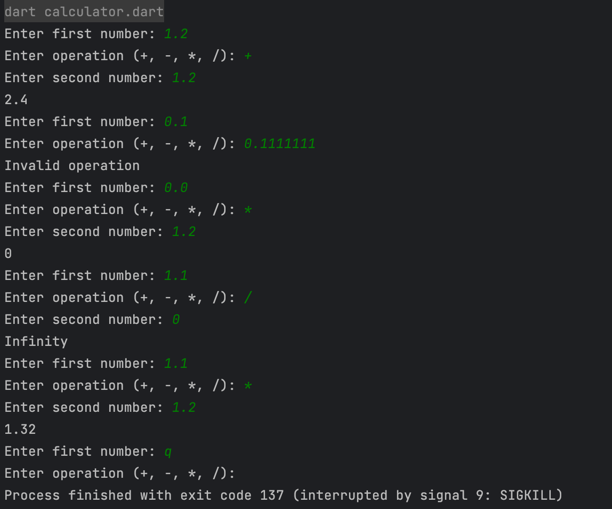

### How to Start?
```dart run lib/calculator.dart```


[console img]


[요구사항]

0. [ㅇ] 마감기한 : 2024-07-27 16:46
1. [ㅇ] 삼각함수, 미적분, 로그함수 확장성 => Operand? Operation Operand 연산이 필요할 수 있다.
2. [ㅇ] 테스트와 객체지향에 집중해서 코딩
3. [o] 연산기능 지원
   3-1. 덧셈
   3-2. 뺄셈
   3-3. 곱셈
   3-4. 나눗셈
   3-5. 연산자 ::= +, -, *, /
4. [o] 피연산자 지원
   4-1. 0-9 사이의 문자가 1개 이상 있어야한다
   4-2. 소숫점이 0개 또는 1개 존재한다
   4-3. 0-9 사이의 숫자가 0개 이상 반복된다
   4-4. 1000 단위 구분 기호 없음
5. [o] 입력
   5-1. 피연산자 연산자 피연산자
6. [o] 출력
   6-1. 1000 단위 구분 기호 없음
   6-2. 결과를 콘솔에 출력한다# fancy-calculator
